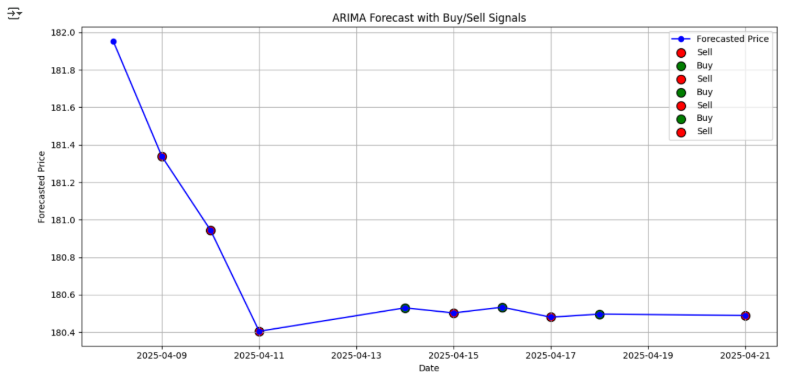
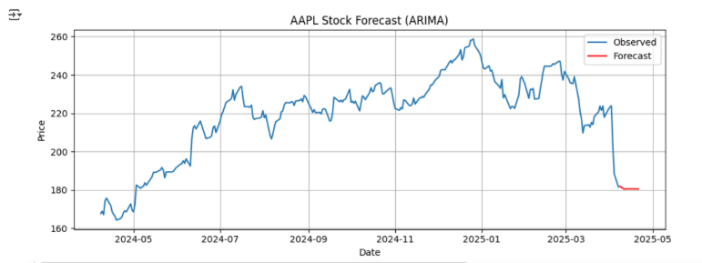

# 📈 Stock Price Forecasting and Trading Strategy Optimization using ARIMA

This project is focused on forecasting stock prices using the **ARIMA (AutoRegressive Integrated Moving Average)** model and generating **Buy/Sell trading signals** based on predicted price movements. We use **historical stock data** fetched via the `yfinance` API and visualize both the forecast and trading signals using `matplotlib`.

---

## 🧠 Project Summary

- 📦 **Model Used**: ARIMA (5,1,0)
- 🗃️ **Data Source**: Yahoo Finance (`yfinance`)
- 🧮 **Target Variable**: Closing price of selected stock (example: Apple Inc. - `AAPL`)
- 📅 **Timeframe**: Past 1 Year (from today's date)
- 💹 **Forecast Window**: Next 10 business days
- 📍 **Signals Generated**:
  - 🔼 **Buy** when next predicted price is higher than the previous.
  - 🔽 **Sell** when next predicted price is lower than the previous.

---

## 🧰 Tools and Libraries

- [`yfinance`](https://pypi.org/project/yfinance/) – fetch stock data
- [`statsmodels`](https://www.statsmodels.org/stable/index.html) – ARIMA modeling
- `pandas` – data manipulation
- `matplotlib` – data visualization
- `datetime` – date range generation
- `warnings` – suppress warnings for clean output

## 🖼️ Example Screenshots

- 1. 📊 ARIMA Forecasted Stock Prices with Buy/Sell Signals  
  

- 2. 📈 AAPL Stock Forecast  
  


---

## 🔧 Installation

Install the required Python libraries using:

```bash
pip install yfinance statsmodels matplotlib pandas
